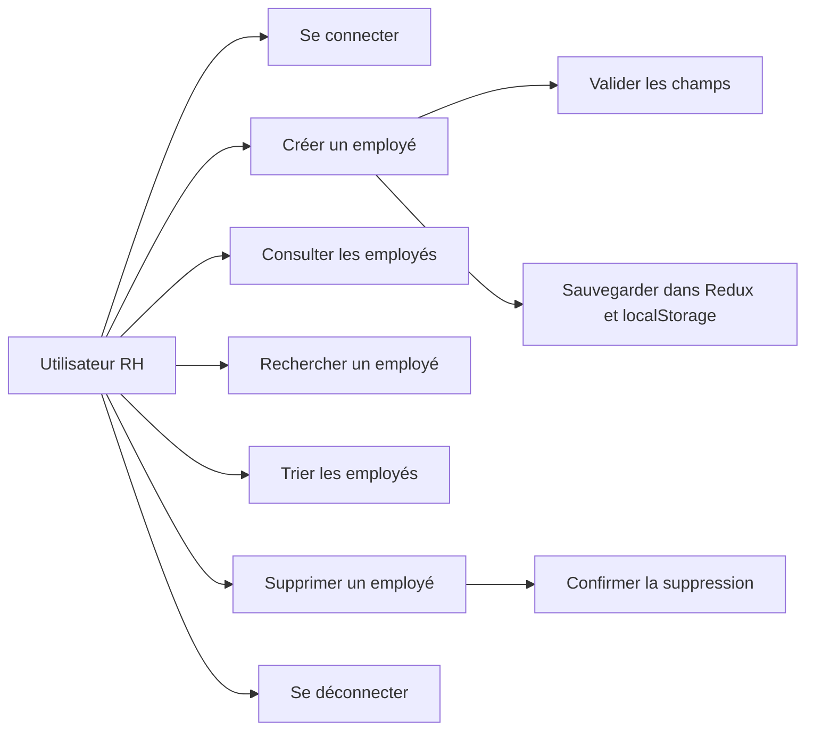

# HRnet

**HRnet** est une application de gestion des employés développée avec **React**, dans le cadre du programme de formation Développeur Front-end JavaScript React chez OpenClassrooms. Elle permet de créer, consulter, rechercher, trier et supprimer des employés via une interface claire et responsive.

Ce projet a été réalisé dans le cadre d’un processus de modernisation front-end, remplaçant une ancienne application interne développée en jQuery par une architecture React.

## Fonctionnalités

### Gestion des employés

- Création d’employés via un formulaire avec validation des champs de saisis
- Consultation des la liste des employés dans un tableau
- Suppression d'un employé avec fenêtre de confirmation
- Enregistrer les employés dans le state global Redux
- Sauvegarde des données via le Local Storage

### Recherche & Tri

- Barre de recherche globale
- Recherche insensible aux accents
- Tri croissant / décroissant des colonnes

### UX / Accessibilité

- Design responsive (ordinateur / mobile)
- Labels accessibles sur les formulaires
- Fenêtres modales accessibles

## Stack technique

| Élément             | Technologie                 |
| ------------------- | --------------------------- |
| Framework front-end | React                       |
| Bundler             | Vite                        |
| Routing             | React Router                |
| State management    | Redux Toolkit               |
| Persistance locale  | localStorage                |
| Table de données    | react-data-table-component  |
| Formulaires         | React controlled components |
| Date picker         | react-datepicker            |
| Masque de saisie    | @react-input/mask           |
| Styles              | SCSS Modules                |
| Documentation       | Markdown / Mermaid UML      |

---

## Architecture générale

```text
src/
├── assets/
├── components/
│   ├── DataTableBase/
│   ├── Header/
│   ├── Footer/
│   └── RequiredAuth/
├── data/
│   ├── services.json
│   └── states.json
├── hooks/
│   ├── useMaskedDateFieldUs.js
│   └── useRegex.js
├── pages/
│   ├── Home/
│   ├── Login/
│   ├── CreateEmployee/
│   └── ListEmployees/
├── service/
│   └── api.js
├── store/
│   ├── authSlice.js
│   ├── userSlice.js
│   └── employeesSlice.js
├── styles/
└── main.jsx
```

---

## Acteurs

| Acteur                 | Rôle                                          |
| ---------------------- | --------------------------------------------- |
| Utilisateur RH         | Utilise l’application pour gérer les employés |
| Application HRnet      | Interface front-end React                     |
| Store Redux            | Centralise les données user et employés       |
| localStorage           | Persistance des données employés localement   |
| API d’authentification | Valide l’identité de l’utilisateur            |

---

## User Stories

### US-01 — Connexion adminitrateur RH

**En tant qu’administrateur RH**, je veux pouvoir me connecter à l’application afin d’accéder aux fonctionnalités de gestion des employés.

#### Critères d’acceptation

- L’administrateur RH peut saisir son email et son mot de passe.
- Si les identifiants sont valides, il est redirigé vers l’espace interne.
- Le token d’authentification est stocké.
- Si les identifiants sont invalides, un message d’erreur est affiché.

---

### US-02 — Protection des routes

**En tant qu’utilisateur non connecté**, je ne dois pas pouvoir accéder aux pages internes de l’application (Données personnelles - RGPD)

#### Critères d’acceptation

- Les pages protégées vérifient la présence d’un token.
- En absence de token, l’utilisateur est redirigé vers la page de connexion.
- En présence d’un token, l’accès est autorisé.

---

### US-03 — Création d’un employé

**En tant qu’administrateur RH**, je veux pouvoir créer un employé afin d’enregistrer ses informations dans l’application.

#### Critères d’acceptation

- Le formulaire contient les champs obligatoires.
- Les noms sont validés.
- Les dates sont saisies au format américain `MM/DD/YYYY`.
- Les champs État et Département sont sélectionnés depuis des listes.
- À la validation, l’employé est ajouté au store Redux.
- Les données sont sauvegardées dans `localStorage`.
- Une modale confirme la création de l’employé.

---

### US-04 — Consultation des employés

**En tant qu’administrateur RH**, je veux consulter la liste des employés afin de visualiser les données enregistrées.

#### Critères d’acceptation

- Les employés sont affichés dans un tableau.
- Les colonnes principales sont visibles.
- La pagination est disponible.
- Le tableau est responsive.

---

### US-05 — Recherche d’un employé

**En tant qu’administrateur RH**, je veux rechercher un employé afin de retrouver rapidement une fiche.

#### Critères d’acceptation

- Un champ de recherche est disponible.
- La recherche filtre plusieurs colonnes.
- Le filtrage est instantané.
- Si aucun résultat n’est trouvé, un message adapté est affiché.

---

### US-06 — Tri des employés

**En tant qu’administrateur RH**, je veux trier les colonnes du tableau afin d’organiser les données.

#### Critères d’acceptation

- Les colonnes triables affichent une icône de tri.
- Le clic sur l’en-tête inverse l’ordre de tri.
- Le tri fonctionne sur les colonnes textuelles et les dates.

---

### US-07 — Suppression d’un employé

**En tant qu’administrateur RH**, je veux supprimer un employé afin de retirer une fiche obsolète.

#### Critères d’acceptation

- Un bouton de suppression est disponible pour chaque employé.
- Une modale demande confirmation.
- Si l’utilisateur confirme, l’employé est supprimé du store.
- Le `localStorage` est mis à jour.
- Si l’utilisateur annule, aucune suppression n’est effectuée.

---

### US-08 — Accessibilité de la modale

**En tant qu’utilisateur**, je veux pouvoir utiliser la modale au clavier afin de garantir une navigation accessible.

#### Critères d’acceptation

- La modale peut être fermée avec la touche `Escape`.
- Le focus est géré à l’ouverture.
- Les boutons sont accessibles au clavier.
- Le clic sur l’overlay peut fermer la modale si l’option est activée.

---

## Diagramme de cas d’utilisation



---

## Sécurité et accès

L’application utilise un mécanisme de protection de routes basé sur la présence d’un token d’authentification.

### Principes

- Les pages internes sont encapsulées dans un composant `RequiredAuth`.
- Si aucun token n’est disponible, l’utilisateur est redirigé vers `/login`.
- Si le token existe, les composants protégés sont rendus.
- Le token peut être stocké dans `localStorage` ou `sessionStorage` selon le comportement attendu.

---

## Accessibilité

Les principaux éléments d’accessibilité concernent :

- l’association correcte des `label` avec les champs via `htmlFor` et `id` ;
- la navigation clavier ;
- la gestion du focus dans la modale ;
- la fermeture de la modale avec `Escape` ;
- les boutons explicites ;
- les messages d’erreur visibles et compréhensibles ;
- les contrastes suffisants.

---

## Installation

```bash
git clone https://github.com/DanickDela/HRnet.git
cd hrnet
npm install
npm run dev
```

Le front-end sera lancé à l'URL: http://localhost:5173/.

## Identifiants de connexion pour l'administrateur

Utilisez les identifiants suivants pour accéder à l’application :

**Email :** admin.hrnet@gmail.com  
**Mot de passe :** admin123

## Auteur

Danick Delaroche

## Licence

## Data

Au chargement, génération aléatoire de 100 employés pour des besoins de test et de démonstration

## Licence

Projet open-source disponible à des fins pédagogiques.
